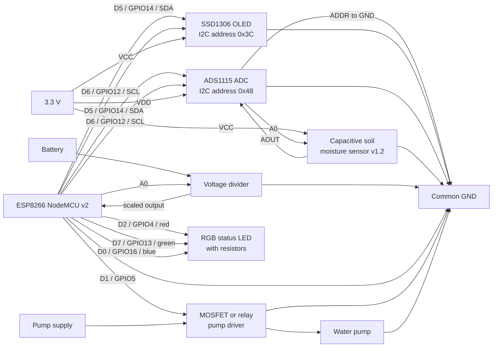

# Wiring Schema

This diagram matches the default pins in `include/config.h`.

## Connection Table

| Module | Module pin | ESP8266 / connection |
|---|---|---|
| SSD1306 OLED | SDA | D5 / GPIO14 |
| SSD1306 OLED | SCL | D6 / GPIO12 |
| SSD1306 OLED | VCC | 3.3 V |
| SSD1306 OLED | GND | Common GND |
| ADS1115 | SDA | D5 / GPIO14 |
| ADS1115 | SCL | D6 / GPIO12 |
| ADS1115 | VDD | 3.3 V |
| ADS1115 | GND | Common GND |
| ADS1115 | ADDR | GND for address `0x48` |
| Soil sensor | AOUT | ADS1115 A0 |
| Soil sensor | VCC | 3.3 V |
| Soil sensor | GND | Common GND |
| Battery divider | Output | ESP8266 A0 |
| Pump driver | Signal | D1 / GPIO5 |
| RGB LED red | Resistor input | D2 / GPIO4 |
| RGB LED green | Resistor input | D7 / GPIO13 |
| RGB LED blue | Resistor input | D0 / GPIO16 |

## Pump Driver Note

Do not connect the pump directly to an ESP8266 GPIO. Use a logic-level MOSFET
or relay module, a flyback diode for a DC motor pump, a pulldown resistor on
the control signal, and a pump power supply sized for the motor.

All modules must share a common ground.
